class: center, middle

## Ensenyament de la Programació al
## Grau en Intel·ligència Artificial

# PA1,  PA2, ABIA, PAA

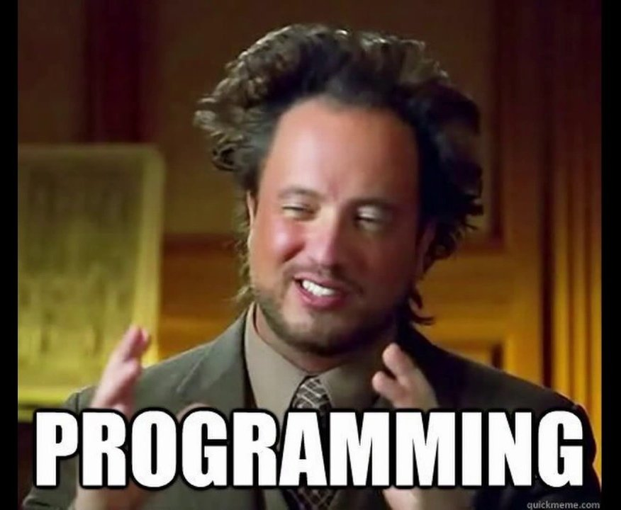

Jordi Delgado, Juny 2024


---

## La font d'inspiració de PA1 & PA2

<br>

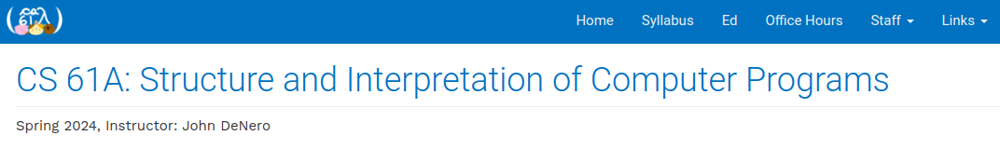
.tiny[https://cs61a.org/]
<br>

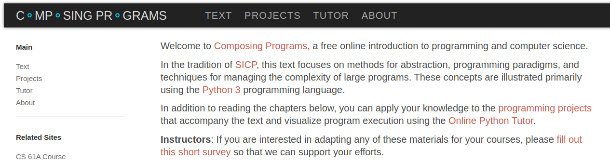
.tiny[https://www.composingprograms.com/]
<br>
<br>
* John DeNero (Giancarlo Teaching Fellow, UC Berkeley EECS department) <br>
 .tiny[.blue[denero@berkeley.edu]]

---

## PA1: _Construint Abstraccions amb Funcions_

.center[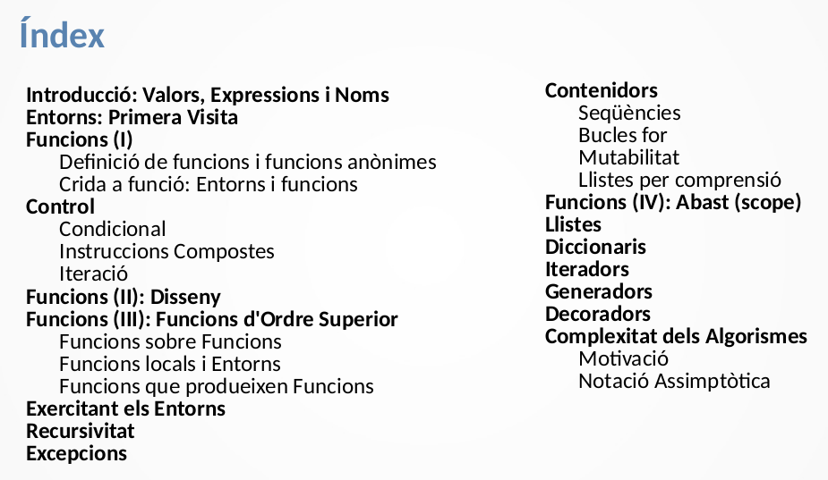]

* laboratori + Pràctica (en parelles) + col·lecció problemes + Jutge

* 80% Nota teoria (_max(final,(parcial+final)/2)_) + 20% Nota pràctica

---

## PA2: _Construint Abstraccions amb Dades_

.center[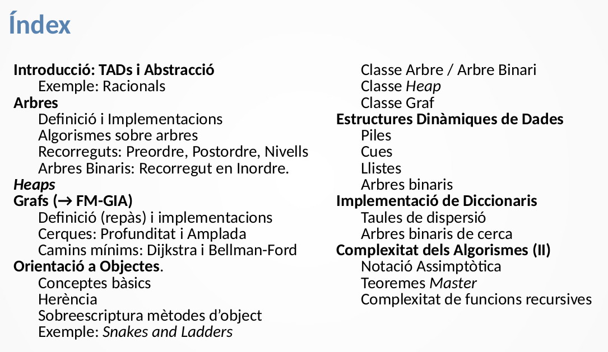]

* laboratori + Pràctica (en parelles) + col·lecció problemes + Jutge

* 80% Nota teoria (_max(final,(parcial+final)/2)_) + 20% Nota pràctica

---

## Eines (1): PythonTutor 

.center[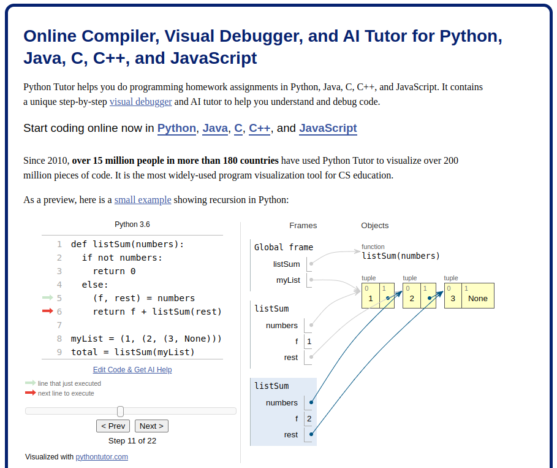]

---

## Eines (&2): Jutge 

.center[]

---

## Col·laboradors

<br>
<br>

* José Luis Balcázar, co-coordinador de PA2, i més coses...

<br>

* Sergio Alvarez-Napagao
* Caroline König

--- 
---

## ABIA: _Algorismes Bàsics per a la IA_

.center[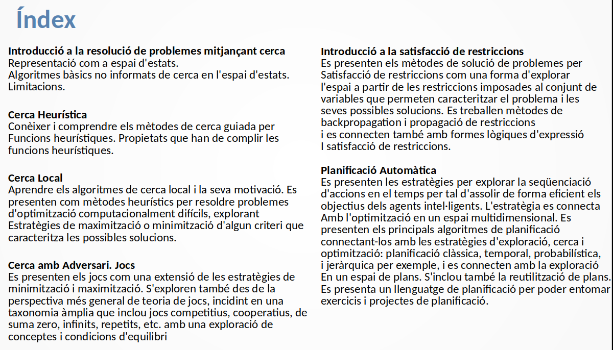]

*  max((parcial $\times$ 0.2 + final $\times$ 0.3), final $\times$ 0.5) + laboratorio $\times$ 0.5
 
*  Python & PDDL: Planning Domain Description Language

---

## PAA: _Programació i Algorísmica Avançades_

.center[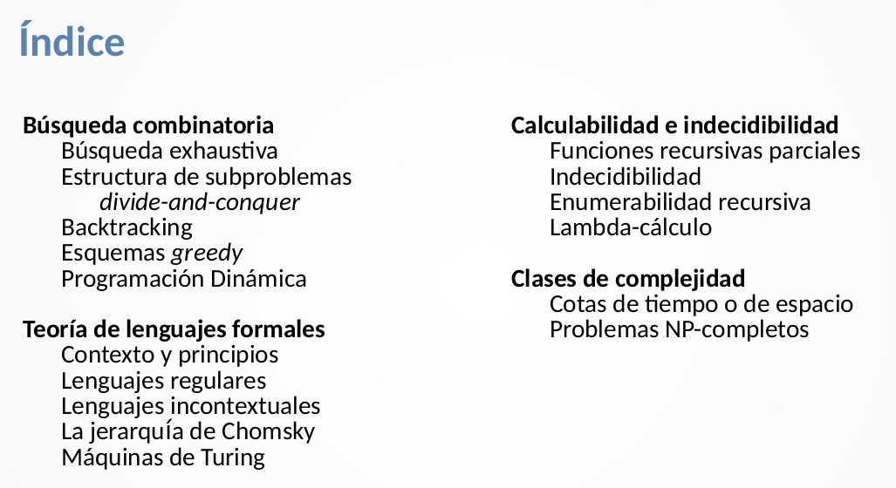]

* laboratori + Pràctica (en parelles) + col·lecció problemes + Jutge

* 80% Nota teoria (_max(final,(parcial+final)/2)_) + 20% Nota pràctica

---

---

## Structure and Interpretation of Computer Programs (SICP)

<br>

.center[
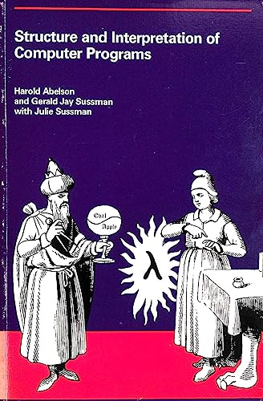

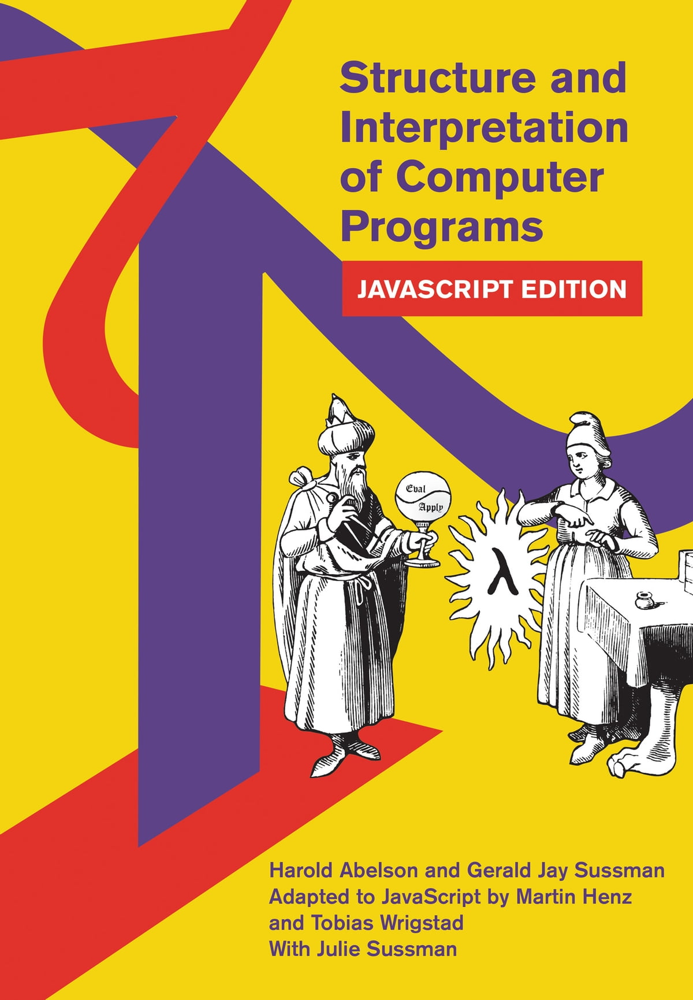
]

<br>

* Textbook for MIT's former introductory programming course, 6.001, from 1984 to 2007

* First edition 1984, second edition 1996, Javascript edition 2022

---

## _Not really..._ Lisp seminars, FIB, 80's

<br>
<br>

```scheme
(define (abs x)
  ((if (< x 0) - +) x))
```

<br>
<br>

.col5050[
.col1[
]
.col2[
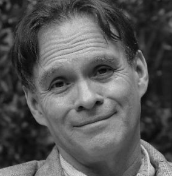
.tiny[_¡Gracias Ulises!_]
]
]

---

## Why SICP matters (2011, 150th anniversary of MIT)

<br>
<br>

.center[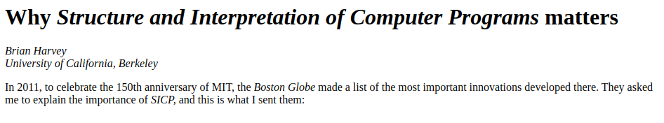]
.tiny[https://people.eecs.berkeley.edu/~bh/sicp.html]

<br>

_Berkeley's new first course for majors uses Python, with lecture
notes that try to keep the ideas (and some of the text) of SICP._

---

## _Standard Model of Languages_ (SMoL)


* _lexical scope_
* _nested scope_
* _eager evaluation_
* _sequential evaluation (per “thread”)_
* _mutable first-order variables_
* _mutable first-class structures (objects, vectors, etc.)_
* _higher-order functions that close over bindings_
* _automated memory management (e.g., garbage collection)_

<br>

Kuang-Chen Lu and Shriram Krishnamurthi. 2024. 
Identifying and Correcting Programming Language Behavior Misconceptions. 
Proc. ACM Program. Lang. 8, OOPSLA1, Article 106 (April 2024),
https://doi.org/10.1145/3649823
